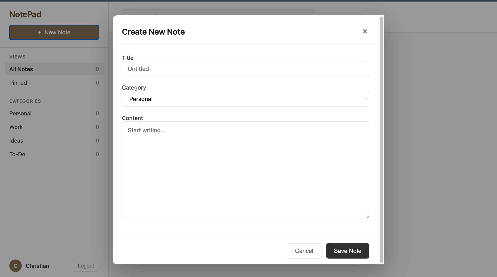

## Setup Instructions

1. Clone the repository
2. Install dependencies: `npm install`
3. Copy `.env.example` to `.env`: `cp .env.example .env`
4. Fill in your credentials in `.env`
5. Generate local SSL certificates: `mkcert localhost`
6. Run the server: `npm start`

**Never commit your `.env` file or SSL certificates!**

