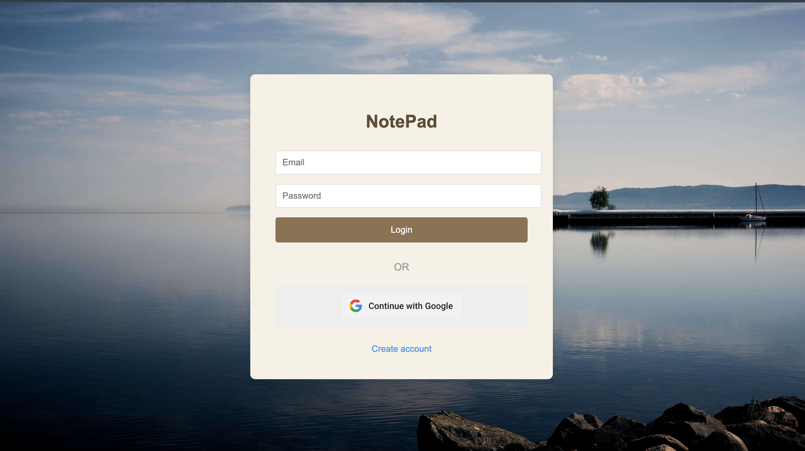
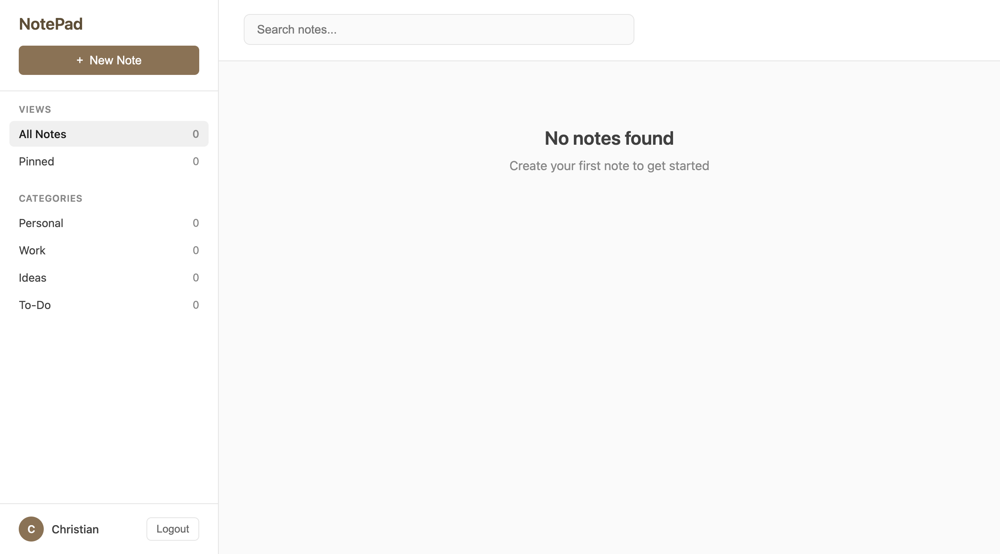

# Final Project

A Node.js web application using Express, MySQL, Passport (Google OAuth), and EJS.

---

## Tech Stack

| Layer | Technology |
|---|---|
| **Runtime** | Node.js |
| **Framework** | Express 4 |
| **Database** | MySQL / MySQL2 |
| **Authentication** | Passport.js (Google OAuth 2.0 / OIDC) |
| **Sessions** | express-session, cookie-session, MySQL session store |
| **Security** | CSRF protection (csurf, csrf-sync), HTTPS redirect |
| **Templating** | EJS (with some legacy Jade) |
| **Logging** | Morgan |
| **Environment** | dotenv |
| **Dev Tools** | Nodemon |

---

## Project Structure

```
project-root/
├── bin/
│   └── www                     # Server entry (Express default)
├── config/
│   ├── db.js                   # Database connection
│   ├── login.js                # Login configuration
│   └── passport-setup.js       # Passport.js config
├── middleware/
│   └── csrf.js                 # CSRF protection middleware
├── public/
│   ├── images/                 # Static images
│   ├── javascripts/            # Frontend JS
│   └── stylesheets/            # CSS files
├── routes/
│   ├── auth-routes.js          # Authentication routes
│   ├── csrf.js                 # CSRF route handling
│   ├── dashboard.js            # Dashboard routes
│   └── notes.js                # Notes routes
├── views/                      # EJS templates
│   ├── dashboard.ejs
│   ├── error.ejs
│   └── login.ejs
├── readme-photos/              # Images used in README
├── schema.sql                  # Database schema
├── team-project.js             # App entry (dev)
├── package.json
├── package-lock.json
├── .env
├── .env.example
└── README.md
```

---

## Getting Started

### 1. Clone the repository

```bash
git clone <your-repo-url>
cd <your-project-folder>
```

### 2. Install dependencies

```bash
npm install
```

### 3. Configure environment variables

Copy the example file:

```bash
cp .env.example .env
```

Then update `.env`:

```env
DB_HOST=localhost
DB_USER=root
DB_PASSWORD=
DB_NAME=your_database
PORT=3000

GOOGLE_CLIENT_ID=your_client_id
GOOGLE_CLIENT_SECRET=your_client_secret

SESSION_SECRET=your_session_secret
```

### 4. (Optional) Generate local SSL certificates

```bash
mkcert localhost
```

### 5. Start the server

```bash
# Development
npm run devStart

# Production
npm start
```

> ⚠️ **Never commit your `.env` file or SSL certificates!**

---

## API Routes

| Method | Endpoint | Description |
|---|---|---|
| `GET` | `/auth/google` | Google OAuth login |
| `GET` | `/auth/logout` | Logout user |
| `GET` | `/dashboard` | User dashboard |
| `GET` | `/notes` | Get all notes |
| `POST` | `/notes` | Create a note |
| `PUT` | `/notes/:id` | Update a note |
| `DELETE` | `/notes/:id` | Delete a note |

---

## Data Flow

```
Request → Route → Middleware → Auth/Controller → Database
                                      ↓
Response ←──────────── Render (EJS) / JSON
```

---

## Scripts

| Command | Description |
|---|---|
| `npm run devStart` | Start with nodemon (development) |
| `npm start` | Start with node (production) |

---

## Screenshots

### Login Page



### Dashboard


### Notes View


