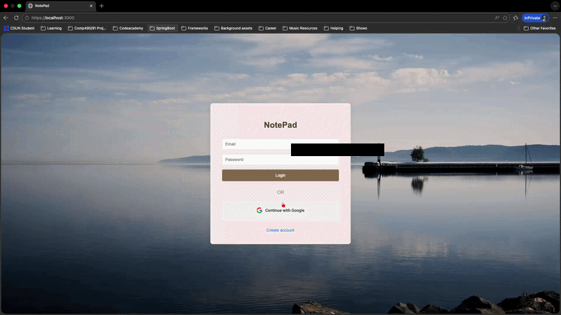

# NotePad - Security Class Project

A Node.js MVC-style web application using a layered architecture for managing personal notes, built with Express, MySQL, Passport.js, and a static HTML/CSS/JS frontend. Designed to demonstrate secure backend architecture and production-style API design.



---

## Tech Stack

- **Backend:** Node.js, Express (ES Modules)
- **Database:** MySQL (mysql2, Knex)
- **Auth:** Passport.js (Google OAuth 2.0 + manual login), express-session, express-mysql-session
- **Security:** Helmet (CSP), CORS, CSRF (csrf-sync), HTTP-only cookies, Argon2 password hashing
- **Logging:** Morgan
- **Frontend:** HTML, CSS, JavaScript
- **Containerization:** Docker, docker-compose

---

## Project Structure

```
FinalProject/
├── config/
│   ├── db.js
│   └── passport-setup.js
├── controllers/
│   ├── AuthController.js
│   └── NoteController.js
├── dtos/
│   └── UserDTO.js
├── frontend/
│   ├── images/
│   ├── javascripts/
│   ├── stylesheets/
│   ├── index.html
│   └── dashboard.html
├── middleware/
│   ├── cors.js
│   ├── csrf.js
│   ├── securityHeaders.js
│   ├── sessionStore.js
│   └── sessions.js
├── migrations/
├── repository/
│   ├── NoteRepository.js
│   ├── OAuthRepository.js
│   └── UserRepository.js
├── routes/
│   ├── auth-routes.js
│   ├── csrf.js
│   ├── notes.js
│   └── router.js
├── services/
│   ├── AuthService.js
│   └── userService.js
├── app.js
├── index.js
├── knexfile.cjs
├── Dockerfile
├── docker-compose.yml
└── .env
```

---

## Setup

### 1. Install dependencies

```bash
npm install
```

### 2. Create `.env`

```env
NODE_ENV=development
PORT=3000

MYSQL_HOST=localhost
MYSQL_PORT=3306
MYSQL_USER=root
MYSQL_PASSWORD=yourpassword
MYSQL_DATABASE=notepad

COOKIE_SECRET=your_secret_key

GOOGLE_CLIENT_ID=your_google_client_id
GOOGLE_CLIENT_SECRET=your_google_client_secret
GOOGLE_CALLBACK_URL=http://localhost:3000/api/v1/auth/google/redirect
```

### 3. Run database migrations

```bash
npx knex migrate:latest
```

### 4. Run the app

```bash
# Development
npm run devStart

# Production
npm start
```

### 5. Run with Docker

```bash
docker compose up -d --build
```

---

## Access

**Frontend:**
http://localhost:3000

**API:**
http://localhost:3000/api/v1/

---

## API Endpoints

### CSRF

| Method | Endpoint | Description |
|--------|----------|-------------|
| GET | /api/v1/csrf | Get CSRF token |

### Auth

| Method | Endpoint | Description |
|--------|----------|-------------|
| POST | /api/v1/auth/login | Login with email and password |
| POST | /api/v1/auth/signup | Create a new account |
| POST | /api/v1/auth/logout | Logout user |
| GET | /api/v1/auth/user | Get current logged in user |
| GET | /api/v1/auth/google | Google OAuth login |
| GET | /api/v1/auth/google/redirect | Google OAuth callback |

### Notes

| Method | Endpoint | Description |
|--------|----------|-------------|
| GET | /api/v1/notes | Get all notes for logged in user |
| POST | /api/v1/notes | Create a note |
| PUT | /api/v1/notes/:id | Update a note |
| DELETE | /api/v1/notes/:id | Delete a note |

---

## Data Flow

```
Request → Route → Middleware → Controller → Service → Repository → MySQL
                                                            ↓
Response ← Controller ← DTO ←─────────────────────────────┘
```

---

## Authentication

- Supports Google OAuth 2.0 and manual email/password login
- Sessions stored in MySQL via express-mysql-session
- Passwords hashed with Argon2
- Cookie: `connect.sid` (HTTP-only, Secure in production)
- Session regenerated on login to prevent session fixation

---

## Security

- CSRF protection on all POST, PUT, DELETE routes via csrf-sync
- HTTP-only, Secure session cookies
- Helmet CSP with base-uri, form-action, and frame-ancestors directives
- CORS restricted to allowed origins only
- Note access returns 404 for both missing and unauthorized notes (prevents enumeration)
- Parameterized queries via Knex (prevents SQL injection)
- Trust proxy enabled for secure cookies behind Nginx

---
